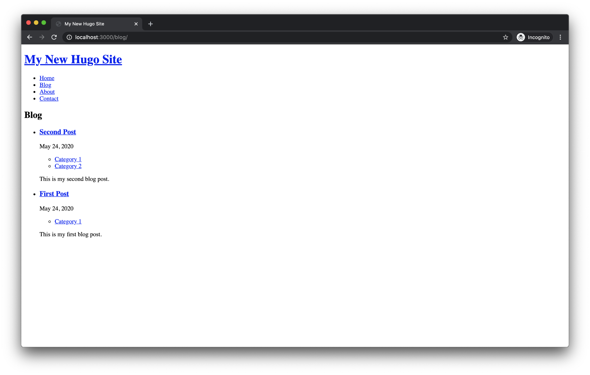

# Hugo Starter Theme

This is a very simple boilerplate for a [Hugo](https://gohugo.io) theme. It contains useful blocks and partials for the most important page elements.

## Features

The theme is very simple and contains no styling. It's meant as a starting point for building your own theme on top of it. The theme provides the following features:

- **Templates for pages, blog posts and sections**
- **Post categories**
- **Navigation** (with CSS class for highlighting the current page)
- **RSS feeds**
- **404 page** ([may require additional setup](https://gohugo.io/templates/404#automatic-loading), depending on your hosting provider)

## Usage

Make sure you have Hugo installed.

1. Initialize a new site with Hugo: `hugo new site my-site`
2. Navigate into the project directory: `cd my-site`
3. Create a new Git repository: `git init`
4. Download Hugo Starter Theme: `git submodule add https://github.com/samuelmeuli/hugo-starter-theme themes/hugo-starter-theme`
5. Activate the theme: `echo 'theme = "hugo-starter-theme"' >> config.toml`
6. Import the theme's sample content: `cp -r themes/hugo-starter-theme/example-site/content/ content/`
7. Run Hugo in development mode: `hugo server --buildDrafts --buildFuture --port 3000`
8. Visit http://localhost:3000 and enjoy your new website!

## Example

An example site building on this theme can be found [here](https://github.com/samuelmeuli/samuelmeuli.com).

## Contributing

Suggestions and contributions are always welcome! Please discuss larger changes via issue before submitting a pull request.
